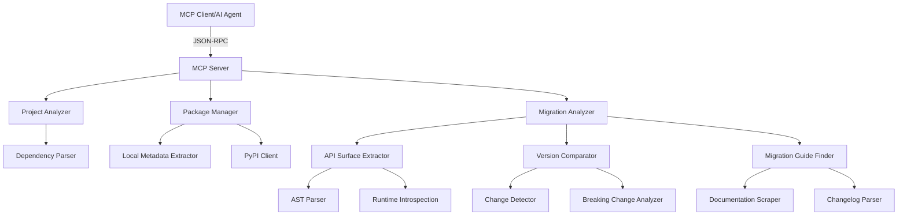

# Design Document

## Overview

The Package Migration Tool extends the existing Python Package MCP Server with specialized capabilities for analyzing package API surfaces and assisting with version migrations. The tool integrates seamlessly with the current architecture while adding new components for API introspection, version comparison, and migration guidance.

The design follows the existing patterns of local-first analysis with PyPI fallback, async operations, and structured data models. The migration tool adds three new MCP tools that leverage both static analysis and runtime introspection to provide comprehensive migration assistance.

## Architecture

### Extended Architecture



### New Components Integration

The migration tool adds a new `MigrationAnalyzer` component that works alongside existing components:

1. **Reuses existing infrastructure**: PackageManager for package retrieval, error handling, and logging
2. **Extends data models**: New models for API surfaces and migration information
3. **Adds new MCP tools**: Three new tools registered with the existing FastMCP server

## Components and Interfaces

### 1. Migration Analyzer (New)

**Purpose**: Main coordinator for migration analysis operations

**Key Classes**:
- `MigrationAnalyzer`: Main interface for migration operations
- `APISurfaceExtractor`: Extracts public API information from packages
- `VersionComparator`: Compares API surfaces between versions
- `MigrationGuideFinder`: Locates migration resources and documentation

**Interfaces**:
```python
class MigrationAnalyzer:
    async def analyze_api_surface(self, package_name: str, version: str) -> APISurface
    async def compare_versions(self, package_name: str, old_version: str, new_version: str) -> VersionComparison
    async def find_migration_resources(self, package_name: str, old_version: str, new_version: str) -> MigrationResources

class APISurfaceExtractor:
    async def extract_from_package(self, package_name: str, version: str) -> APISurface
    def extract_from_module(self, module) -> APISurface
    def analyze_ast(self, source_code: str) -> APISurface
```

### 2. API Surface Extraction

**Purpose**: Analyzes Python packages to extract public API information

**Strategy**:
1. **Local Installation Analysis**: Use importlib and runtime introspection for installed packages
2. **Source Code Analysis**: Download and parse source code using AST for unavailable packages
3. **Hybrid Approach**: Combine both methods for comprehensive analysis

**Key Features**:
- Extract classes, functions, methods with signatures
- Identify public vs private members (underscore convention)
- Capture docstrings and type hints
- Detect deprecation markers

### 3. Version Comparison Engine

**Purpose**: Compares API surfaces between package versions to identify changes

**Analysis Types**:
- **Additions**: New classes, methods, or functions
- **Removals**: Deleted public API elements (breaking changes)
- **Modifications**: Changed method signatures or behavior
- **Deprecations**: Newly deprecated functionality

**Change Detection Logic**:
```python
class VersionComparator:
    def detect_breaking_changes(self, old_api: APISurface, new_api: APISurface) -> List[BreakingChange]
    def detect_additions(self, old_api: APISurface, new_api: APISurface) -> List[APIAddition]
    def detect_deprecations(self, old_api: APISurface, new_api: APISurface) -> List[Deprecation]
```

### 4. New MCP Tools

**Tool 1: `analyze_package_api_surface`**
- Extracts complete public API for a specific package version
- Returns structured API information including signatures and documentation

**Tool 2: `compare_package_versions`**
- Compares two package versions and identifies all changes
- Categorizes changes by type and impact level

**Tool 3: `get_migration_resources`**
- Finds migration guides, changelogs, and upgrade documentation
- Scrapes package repositories and documentation sites

## Data Models

### New Migration-Specific Models

```python
@dataclass
class APIElement:
    name: str
    type: str  # 'class', 'function', 'method', 'property'
    signature: str
    docstring: str = ""
    is_deprecated: bool = False
    deprecation_message: str = ""
    source_location: str = ""

@dataclass
class APISurface:
    package_name: str
    version: str
    classes: List[APIElement] = field(default_factory=list)
    functions: List[APIElement] = field(default_factory=list)
    constants: List[APIElement] = field(default_factory=list)
    modules: List[str] = field(default_factory=list)
    extraction_method: str = ""  # 'runtime', 'ast', 'hybrid'

@dataclass
class APIChange:
    element_name: str
    change_type: str  # 'added', 'removed', 'modified', 'deprecated'
    old_signature: str = ""
    new_signature: str = ""
    impact_level: str = ""  # 'breaking', 'compatible', 'enhancement'
    description: str = ""

@dataclass
class VersionComparison:
    package_name: str
    old_version: str
    new_version: str
    breaking_changes: List[APIChange] = field(default_factory=list)
    additions: List[APIChange] = field(default_factory=list)
    modifications: List[APIChange] = field(default_factory=list)
    deprecations: List[APIChange] = field(default_factory=list)
    dependency_changes: List[str] = field(default_factory=list)

@dataclass
class MigrationResource:
    title: str
    url: str
    type: str  # 'official_guide', 'changelog', 'community_guide', 'blog_post'
    version_range: str = ""
    description: str = ""

@dataclass
class MigrationResources:
    package_name: str
    version_range: str
    official_guides: List[MigrationResource] = field(default_factory=list)
    changelogs: List[MigrationResource] = field(default_factory=list)
    community_resources: List[MigrationResource] = field(default_factory=list)
```

## Error Handling

### Migration-Specific Error Handling

**New Error Types**:
- `PackageAnalysisError`: Failed to analyze package API surface
- `VersionComparisonError`: Cannot compare specified versions
- `MigrationResourceError`: Unable to find migration documentation

**Error Handling Strategy**:
- **Graceful Degradation**: Return partial results when some analysis fails
- **Fallback Methods**: Try multiple extraction methods (runtime → AST → metadata)
- **Clear Error Messages**: Provide specific guidance for common failure scenarios

### Integration with Existing Error Handling

```python
# Extend existing error hierarchy
class MigrationAnalysisError(Exception):
    """Base exception for migration analysis errors"""
    pass

class PackageAnalysisError(MigrationAnalysisError):
    """Failed to analyze package API surface"""
    pass
```

## Testing Strategy

### Unit Testing Approach

**API Surface Extraction Testing**:
- Mock package installations for consistent test environments
- Test with sample packages of known API surfaces
- Verify AST parsing with synthetic Python code samples

**Version Comparison Testing**:
- Create test packages with known API changes
- Test edge cases (major version jumps, pre-release versions)
- Validate change detection accuracy

**Migration Resource Testing**:
- Mock HTTP responses for documentation scraping
- Test with real package repositories (cached responses)
- Verify resource categorization logic

### Integration Testing

**End-to-End Migration Workflows**:
- Test complete migration analysis for popular packages
- Verify MCP tool integration with existing server
- Test error handling and fallback scenarios

**Performance Testing**:
- Measure API extraction time for large packages
- Test concurrent version analysis operations
- Validate memory usage during AST parsing

## Implementation Considerations

### Package Analysis Strategy

**Local-First Approach**:
1. Check if target package version is locally installed
2. Use runtime introspection for comprehensive API extraction
3. Fall back to downloading and AST parsing if not available
4. Cache analysis results to avoid repeated work

**AST Analysis for Unavailable Packages**:
- Download source distributions from PyPI
- Parse Python files using `ast` module
- Extract public API elements based on naming conventions
- Handle common Python patterns (properties, descriptors, etc.)

### Performance Optimizations

**Caching Strategy**:
- Cache API surface analysis results by package name and version
- Use file modification time for cache invalidation
- Implement LRU cache for frequently analyzed packages

**Async Operations**:
- Use async HTTP clients for PyPI API calls
- Implement concurrent analysis for version comparisons
- Stream large package downloads to avoid memory issues

### Security Considerations

**Safe Code Analysis**:
- Use AST parsing instead of code execution for untrusted packages
- Sandbox package downloads to temporary directories
- Validate package signatures when available
- Limit analysis to public PyPI packages only

### Integration Points

**Reuse Existing Infrastructure**:
- Leverage existing `PackageManager` for PyPI interactions
- Use existing error handling and logging patterns
- Extend current data models rather than creating parallel structures
- Follow existing async patterns and dependency injection